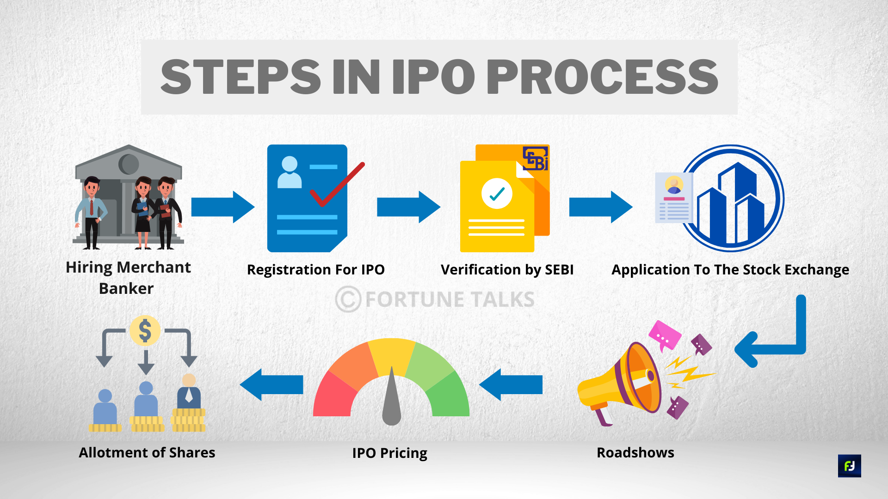

# IPO Process in India

As an investor, you must have endeavored to find a suitable opportunity for investing in Upcoming IPOs. But do you know about the initial public offering process? Well, knowing about the IPO process in India will certainly enhance your knowledge. Read on to know more.

## Understanding The Need For IPO Process

A company can change itself from a privately-held body to a publicly-traded entity through the process of Initial Public Offering (IPO). Typically, companies offer IPO to raise money and get access to liquidity by offering their stocks/shares to the public. Companies have to abide by the IPO process in India - as stipulated by stock exchanges - before its shares are eligible to be publicly traded. This process is often complicated and long-drawn.

## IPO Process Steps

### Step 1: Hiring Of An Underwriter Or Investment Bank

To start the initial public offering process, the company will take the help of financial experts, like investment banks. The underwriters assure the company about the capital being raised and act as intermediaries between the company and its investors. The experts will also study the crucial financial parameters of the company and sign an underwriting agreement.

### Step 2: Registration For IPO

This IPO step involves the preparation of a registration statement along with the draft prospectus, also known as Red Herring Prospectus (RHP). Submission of RHP is mandatory, as per the Companies Act. This document comprises all the compulsory disclosures as per the SEBI and Companies Act.

### Step 3: Verification by SEBI

Market regulator, SEBI then verifies the disclosure of facts by the company. If the application is approved, the company can announce a date for its IPO.

### Step 4: Making An Application To The Stock Exchange

The company now has to make an application to the stock exchange for floating its initial issue.

### Step 5: Creating a Buzz By Roadshows

Before an IPO opens to the public, the company endeavors to create a buzz in the market by roadshows. Over a period of two weeks, the executives and staff of the company will advertise the impending IPO across the country. This is basically a marketing and advertising tactic to attract potential investors.

### Step 6: Pricing of IPO

The company can now initiate pricing of IPO either through Fixed Price IPO or by Book Binding Offering. In the case of Fixed Price Offering, the price of the company’s stocks is announced in advance. In the event of Book Binding Offering, a price range of 20% is announced, following which investors can place their bids within the price bracket.

### Step 7: Allotment of Shares

Once the IPO price is finalized, the company along with the underwriters will determine the number of shares to be allotted to each investor. In the case of over-subscription, partial allotments will be made.

## Other Factors That The Company Consider Before The Initial Public Offering Process Is Complete

Yes, any company will endeavor to prevent company insiders or internal investors from participating in the IPO process. Remember, company insiders trading in their own shares can disrupt the demand and supply balance.

## Conclusion

Now that you know the IPO process steps and its importance, you can make informed decisions to invest in IPOs.
