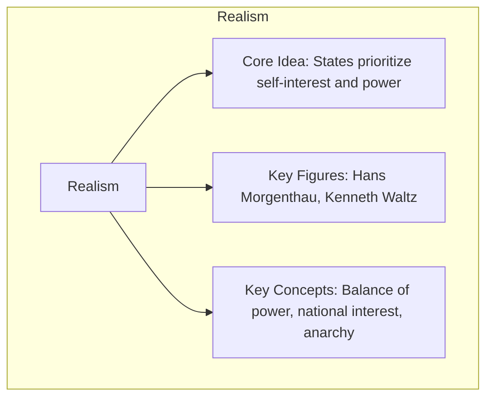

```mermaid
graph TB

subgraph Realism
    A[Realism]
    A --> B[Core Idea: States prioritize self-interest and power]
    A --> C[Key Figures: Hans Morgenthau, Kenneth Waltz]
    A --> D[Key Concepts: Balance of power, national interest, anarchy]
end

```

```mermaid
graph TB

subgraph Liberalism
    E[Liberalism]
    E --> F[Core Idea: States can cooperate through institutions and diplomacy]
    E --> G[Key Figures: Immanuel Kant, Woodrow Wilson]
    E --> H[Key Concepts: Democracy, free trade, international law]
end

subgraph Constructivism
    I[Constructivism]
    I --> J[Core Idea: Role of ideas, norms, and identity]
    I --> K[Key Figures: Alexander Wendt, Martha Finnemore]
    I --> L[Key Concepts: Social norms, identity, ideational factors]
end

subgraph Marxism
    M[Marxism]
    M --> N[Core Idea: Analyzing international relations through economic factors]
    M --> O[Key Figures: Karl Marx, Vladimir Lenin]
    M --> P[Key Concepts: Class struggle, imperialism, economic determinism]
end

subgraph Neorealism
    Q[Neorealism]
    Q --> R[Core Idea: Focuses on the role of international system structure]
    Q --> S[Key Figures: Kenneth Waltz]
    Q --> T[Key Concepts: Structure, bipolarity, multipolarity]
end

subgraph Neoliberalism
    U[Neoliberalism]
    U --> V[Core Idea: Acknowledges the importance of international institutions]
    U --> W[Key Figures: Robert Keohane, Joseph Nye]
    U --> X[Key Concepts: Complex interdependence, regimes, cooperation]
end

subgraph Feminism
    Y[Feminism]
    Y --> Z[Core Idea: Examines the role of gender in international politics]
    Y --> AA[Key Figures: Cynthia Enloe, J. Ann Tickner]
    Y --> AB[Key Concepts: Gender roles, feminist foreign policy, women's rights]
end

subgraph CriticalTheory
    AC[Critical Theory]
    AC --> AD[Core Idea: Critiques power structures for a more just international system]
    AC --> AE[Key Figures: The Frankfurt School, Robert Cox]
    AC --> AF[Key Concepts: Emancipation, discourse, critical reflection]
end
```