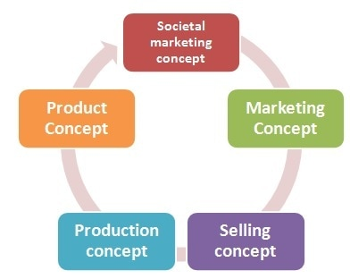

# Concepts of Marketing

## Traditional Concepts

### 1. Production Concept

The Production Concept is one of the oldest philosophies guiding sellers. The production concept holds that consumers will favor those products that are available and highly affordable. Therefore, management should concentrate on improving production and distribution efficiency. 

The production concept is appropriate in two situations:

- When demand for a product exceeds supply. Here management should focus on increasing production.

- When the product cost is high and improved productivity is needed to bring it down.

### 2. Product Concept 

The Product Concept holds that consumers will favor products that offer the most quality, performance and features. Therefore, the organization should devote energy to making continuous product improvements.

### 3. Selling Concept

The Selling Concept holds that consumers will not buy enough unless the organization undertakes substantial selling and promotion efforts. 

The Selling Concept is practiced most aggressively with unsought goods - those that buyers don't normally think of buying like insurance, encyclopedias etc. These industries have perfected sales techniques to sell the benefits of their products.

### 4. Marketing Concept

The Marketing Concept holds that the key to achieving organizational goals is determining target market needs and delivering the desired satisfactions more effectively and efficiently than competitors.

### 5. Societal Marketing Concept 

The Societal Marketing Concept holds that the organization should determine target market needs and deliver desired satisfactions in a way that preserves or enhances the consumer's and society's well-being.

## Modern Concepts

### 1. Customer Orientation

Customer orientation involves understanding consumer wants, attitudes and behavior through research. The purpose is to create and keep customers.

### 2. Integrated Marketing

Integrated marketing integrates the various actions like pricing, inventory, transportation etc. that impact the firm's ability to satisfy customers.

### 3. Customer Satisfaction

Customer satisfaction is key to long term success. Firms must maximize customer satisfaction not just through products but also through problem-solving and related services.

## Conclusion

The marketing concept has evolved from focusing on production and selling to addressing customer needs and society's interests. The modern concepts of customer orientation, integrated marketing and customer satisfaction put the customer at the center.