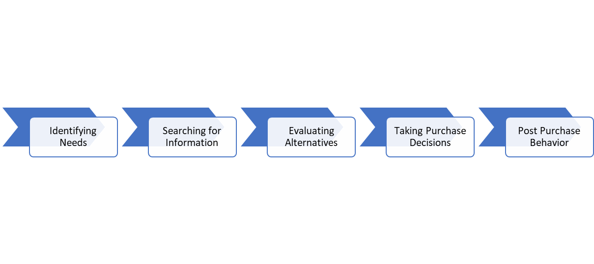

# Buying Decision Process

The buying decision process is a fundamental concept in understanding consumer behavior. It treats consumers as decision-makers who engage in a series of stages when making purchasing choices to solve their consumption problems and satisfy their needs. The process involves several stages that guide consumers through their decision-making journey. Let's explore the stages of the buying decision process:

**Stages of the Buying Decision Process:**

1. **Identifying Needs:**
   - This stage marks the beginning of the buying process.
   - Consumers identify their needs and recognize a problem or desire they want to address.
   - Needs are the driving force behind consumer actions and decisions.
   - For example, individuals may identify the need for life insurance due to a growing sense of insecurity.

2. **Searching for Information:**
   - Once consumers have identified their needs, they seek information to find solutions.
   - Information can be obtained from various sources, including friends, family, neighbors, advertisements, salespeople, dealers, and mass media.
   - Personal sources, such as friends and family, are often considered the most effective in influencing buying decisions.
   - Continuing with the life insurance example, consumers would gather information about available insurance options.

3. **Evaluating Alternatives:**
   - At this stage, consumers have collected information and are ready to evaluate their alternatives.
   - They assess different brands or products available in the market to determine which one best fulfills their needs.
   - Evaluation can be done through logical thinking or by seeking advice from personal sources, such as friends or family.
   - Consumers consider factors like quality, features, benefits, and price when evaluating alternatives.

4. **Taking Purchase Decision:**
   - Evaluation helps consumers rank the available alternatives based on their perceived benefits and value.
   - Consumers then make their purchase decisions, selecting the brand or product that aligns most closely with their needs and preferences.
   - However, external factors like the influence of others and situational factors, such as price fluctuations or income changes, may impact the final decision.

5. **Post Purchase Behavior:**
   - Post-purchase behavior refers to the actions and reactions of consumers after making a purchase.
   - Satisfaction or dissatisfaction arises based on whether the product's actual performance aligns with the consumer's expectations.
   - When expectations are met or exceeded, satisfaction prevails. If there's a significant gap between expectations and reality, dissatisfaction may occur.
   - To ensure consumer satisfaction, companies should regularly measure and evaluate customer feedback and address any issues or concerns promptly.

Understanding the buying decision process helps businesses tailor their marketing strategies, product offerings, and customer support to meet consumers' needs and expectations at each stage of their journey.