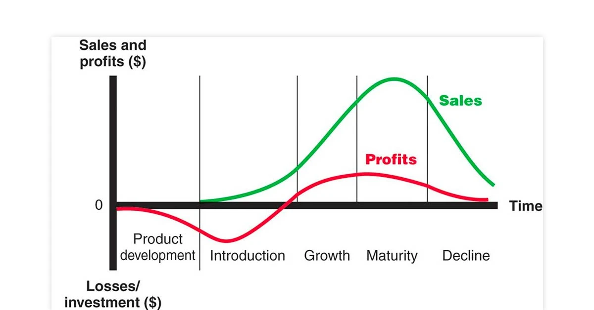
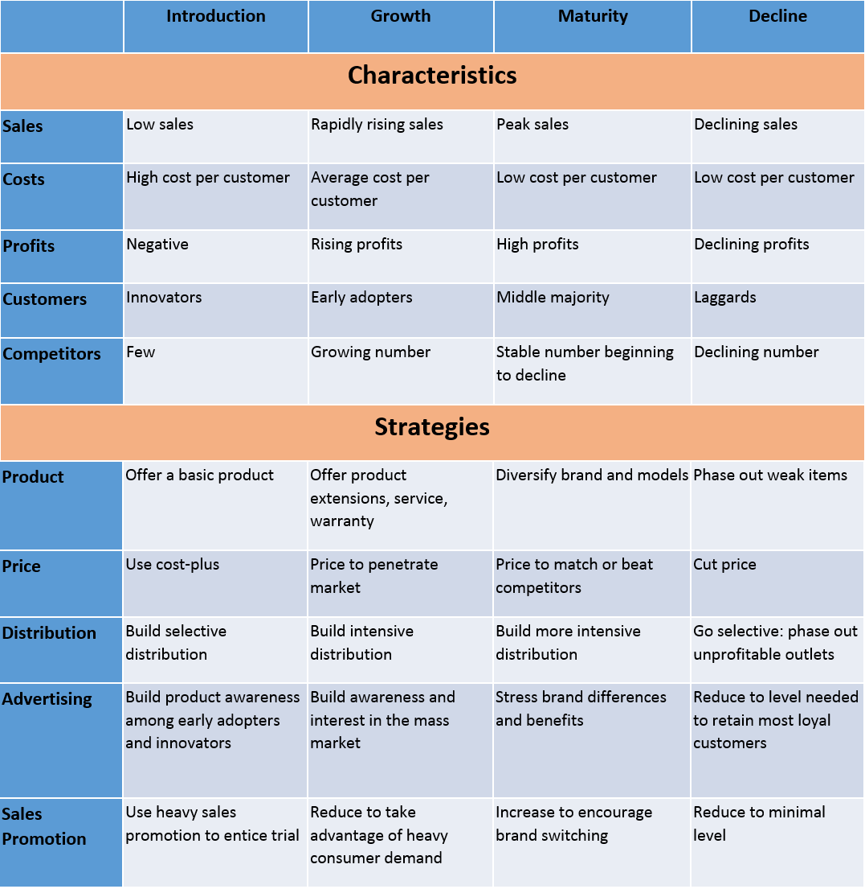
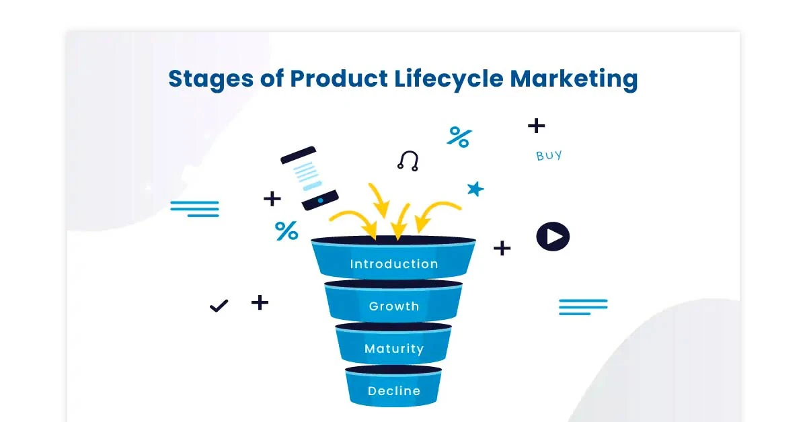

# Product Life-Cycle and Marketing Strategy

The product life-cycle is characterized by the distinction between sales and profit curves. Often, well before sales start to decline, profit margins begin to diminish. To maintain market position, preserve a company's image, and sustain profitability, marketers must continually introduce new products. The product life-cycle influences strategic marketing planning at all levels, encompassing product planning, development, pricing, promotion, and distribution policies.

Effective management of the product life-cycle is essential for the sustained growth and success of a firm. The marketing manager, while forecasting the product life-cycle, should anticipate limitations and drawbacks to formulate successful programs. Below, we discuss how to manage the product life-cycle across various stages.

## 1. Introduction Stage Management

The introduction stage is often plagued by a high percentage of product failures. Profits tend to be low or negative due to low sales and substantial distribution and promotional expenses. There is minimal direct competition initially, and the promotional program aims to stimulate demand. However, competition is bound to increase over time. To effectively manage this stage, the marketing manager should:

- Conduct thorough advertising before product release.
- Aim to shorten the introduction period.
- Develop new pricing and marketing strategies.
- Undertake extensive promotional efforts.
- Pay close attention to distribution aspects.

## 2. Growth Stage Management

The growth stage is characterized by a rapid increase in sales, with potential buyers entering the market. Competition intensifies as new competitors introduce products with enhanced features. The number of outlets also increases. To navigate this crucial stage, the marketing manager should:

- Enhance product quality.
- Incorporate new features and improved styling.
- Explore new market segments.
- Expand distribution channels.
- Consider price reductions to attract buyers.
- Increase promotional activities.

## 3. Maturity Stage Management

During the maturity stage, manufacturers achieve maximum profits through high sales. Price competition becomes fierce, demanding creative selling methods. Sales and profits begin to decline as products lose significance against superior alternatives. Effective management during this stage involves:

- Improving product quality.
- Focusing on increasing usage among existing customers.
- Attracting non-users to become customers.
- Emphasizing advertisement and promotional programs.
- Exploring new applications for the product.

## 4. Saturation Stage Management

In the saturation stage, expanding sales becomes challenging, reaching a peak beyond which further growth is improbable. The marketing manager should consider the following strategies:

- Introducing new product models.
- Exploring new applications for the product.
- Introducing new packaging and pricing.
- Increasing middlemen's margins.
- Offering installment plans for high-priced products.

## 5. Decline Stage Management

The decline stage is the final and most critical phase, marked by declining sales and profits due to various factors. Cost control is paramount during this stage, and profitability can be sustained through the following approaches:

- Improving product functionality or revitalizing it.
- Ensuring efficient marketing and production programs.
- Streamlining the product assortment by eliminating unprofitable variations.
- Minimizing costs to optimize remaining profitability.
- Considering discontinuation of the product.

## Nestle – Maggi Product Life Cycle Case Study

**Introductory Stage in the Product Life Cycle of Maggi:**
- Maggi entered the Indian market in 1982, facing no competition in the instant noodle market.
- It segmented its target audience based on age and urban areas, focusing on kids, youth, and office goers.
- The tagline, 'Taste Bhi, Health Bhi,' emphasized the product's quick preparation.
- Marketing efforts aimed at creating product awareness and adapting to Indian tastes.

**Growth Stage in the Product Life Cycle of Maggi:**
- By 1985, Maggi gained consumer acceptance, leading to increased sales.
- Top Ramen entered the market in 1990, posing a minor threat to Maggi's market share.
- Maggi launched a new flavor in 1997, which did not perform well.
- In 1999, it re-launched its original flavor, resulting in increased sales and profits.
- New product variations like ketchup, pasta, soup, and oats were introduced, but the focus remained on the original product.

**Maturity Stage in the Product Life Cycle of Maggi:**
- Maggi faced stiff competition with Top Ramen during this stage.
- To capture a larger market segment, it introduced a 5 rupees packet in 2010, expanding its distribution.
- This strategy allowed Maggi to gain a larger market share and become a household name.
  
**Decline Stage in the Product Life Cycle of Maggi:**
- In 2015, Maggi faced a crisis when it was banned due to high lead content.
- The ban led to the perception that Maggi had entered the decline stage.
- Through effective PR and marketing, Maggi proved its safety for consumption.
- It invested in research, employee engagement, and social media campaigns.
- Maggi exclusively re-launched itself with Snapdeal, offering pre-orders to loyal customers.
- The brand's message, 'Your Maggi is safe, has always been,' helped it regain popularity.
